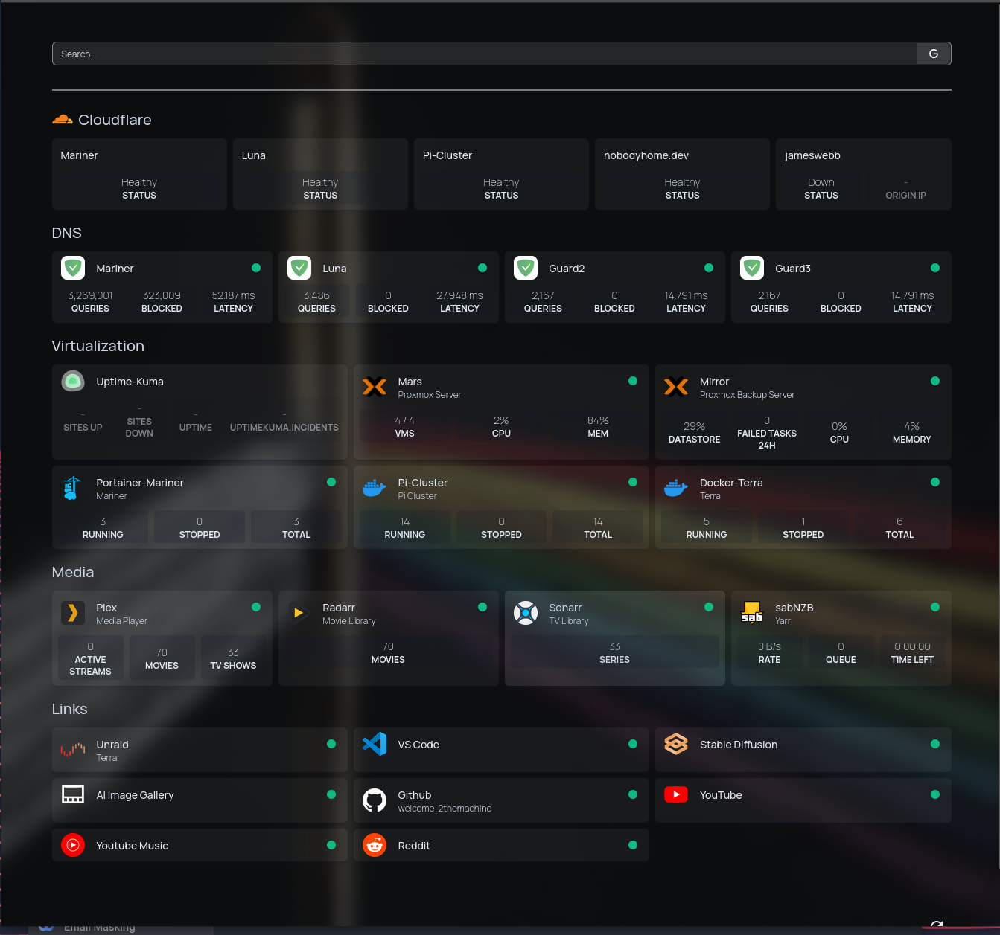

# Homepage

## Introduction

Homepage is my configuration files for a selfhosted hompage on a docker swarm (2x Raspberry Pi 4b 4GB) managed by Portainer.

**Dashbaord**

### Use Case

Use these files a a basis for your own homepage (if you like what I've done) or as inspiration on what not to do.

## Getting Started

Populate your variables in the supplied .env-example

Use the supplied docker-compose file to setup the stack on portainer OR just run using docker-compose.

> [!IMPORTANT]
> Update with more detailed instructions

## References
https://gethomepage.dev/latest/

https://github.com/gethomepage/homepage
